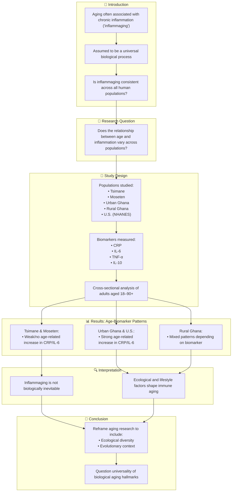

# Reference:
[https://pubmed.ncbi.nlm.nih.gov/40093756/](https://pubmed.ncbi.nlm.nih.gov/40093756/)

# Summary
This paper provides an evidence-based review of "brain fog" and cognitive dysfunction in individuals with post-traumatic stress disorder (PTSD). The term "brain fog" refers to the subjective experience of cognitive difficulties, which is commonly reported by those with PTSD. The review examines the phenomenology of brain fog in PTSD, including its potential origins within PTSD psychopathology, comorbid conditions, and physiological factors. It also discusses the implications of brain fog for assessment and treatment outcomes in PTSD, and provides preliminary recommendations for mental health professionals. 

# Key Points
 1. "Brain fog" is a subjective experience of cognitive impairment or diminished mental capacity, commonly reported by individuals with PTSD
 2. The phenomenology and mechanisms contributing to brain fog in PTSD are poorly understood, with no unified definition or consistent measurement in the literature
 3. Brain fog in PTSD may originate from PTSD psychopathology (e.g., cognitive, affective, and physiological symptoms), comorbid conditions (e.g., depression, anxiety), and physiological factors Brain fog can have implications for assessment and treatment outcomes in PTSD, as it may be a marker of treatment non-response
 4. Further research is needed to better define, measure, and understand brain fog in PTSD, as well as evaluate cognitive remediation as an intervention

# Logic Flow

