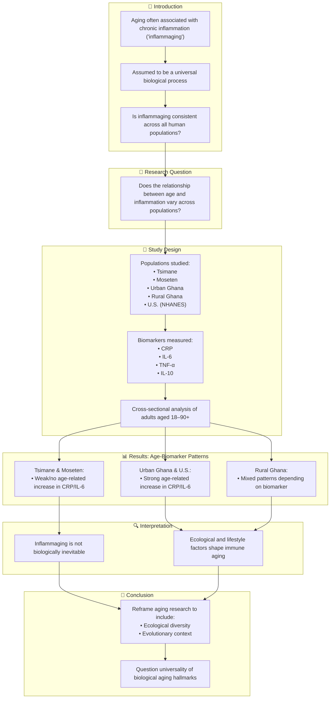

# Reference:
[https://pubmed.ncbi.nlm.nih.gov/40588649/](https://pubmed.ncbi.nlm.nih.gov/40588649/)

### Summary

Franck et al. (2025) challenge the prevailing assumption of universal "inflammaging"—a chronic, systemic, low-grade inflammation associated with aging—by comparing biomarkers across diverse global populations. The study analyzed blood samples from five rural and urban populations in Bolivia, Ghana, and the U.S., including the Tsimane and Moseten Amerindians. Surprisingly, some groups showed little or no age-related increase in inflammatory markers such as CRP and IL-6, suggesting inflammaging is not a universal biological outcome of aging. The findings argue for a more nuanced understanding that incorporates evolutionary, ecological, and lifestyle contexts into aging research.

### Key Points:

1. **Inflammaging** is widely believed to be a universal aging hallmark, but this study disputes that.
2. Researchers measured inflammatory biomarkers (CRP, IL-6, TNF-α, IL-10) across five distinct populations.
3. The Tsimane and Moseten showed no or weak age-related increases in CRP and IL-6.
4. U.S. and urban Ghanaian populations had strong age-related increases in inflammatory markers.
5. Results suggest that lifestyle and ecological context mediate age-related immune changes.
6. Calls for reconsideration of "universal" biological aging theories.

# Logic Flow

