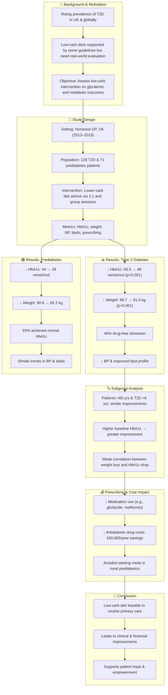

# Reference:
[https://pubmed.ncbi.nlm.nih.gov/33521540/](https://pubmed.ncbi.nlm.nih.gov/33521540/)

# Summary

Unwin et al. (2020) conducted a six-year service evaluation in a UK general practice setting to assess the impact of a lower carbohydrate diet on patients with Type 2 diabetes (T2D) and prediabetes. A total of 199 patients participated, receiving individualized and group-based dietary counseling. Key outcomes included significant reductions in weight, HbA1c, blood pressure, and lipid profiles. Notably, 46% of T2D patients achieved drug-free remission and 93% of prediabetic patients normalized their HbA1c. The study also reported considerable reductions in diabetes medication prescriptions and associated healthcare costs. These real-world results support the viability of incorporating low-carb dietary advice into routine primary care.

# Key Points:

1. A six-year evaluation of low-carb dietary intervention in UK primary care (n=199).
2. Significant improvements in HbA1c, weight, blood pressure, and lipid profiles.
3. 46% of T2D patients achieved drug-free remission.
4. 93% of prediabetic patients reverted to normal HbA1c levels.
5. Medication prescribing and costs significantly reduced.
6. Outcomes were consistent across age and disease duration subgroups.

# Logic Flow

