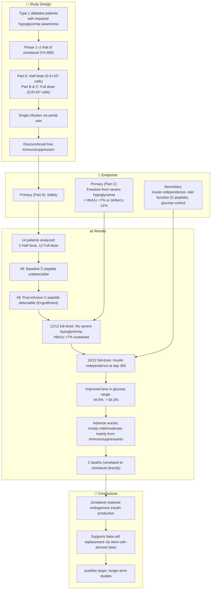

# Reference:
[https://pubmed.ncbi.nlm.nih.gov/40544428/](https://pubmed.ncbi.nlm.nih.gov/40544428/)

# **Summary**

Reichman et al. (2025) conducted a Phase 1–2 study to evaluate **zimislecel (VX-880)**, an allogeneic, stem cell–derived islet-cell therapy designed to restore insulin production in individuals with type 1 diabetes (T1D). Participants with long-standing T1D and impaired awareness of hypoglycemia received either half or full doses of zimislecel via portal vein infusion, combined with immunosuppressive therapy. The study demonstrated that a single full dose could restore islet function, with 83% of participants achieving insulin independence, all achieving freedom from severe hypoglycemic events, and marked improvements in glycemic control. Most adverse events were manageable and linked to immunosuppression. These findings suggest that zimislecel may offer a viable, scalable beta-cell replacement therapy, supporting further investigation.

---

# **Key Points**

1. Zimislecel is a fully differentiated, allogeneic stem cell–derived islet therapy.
2. Phase 1–2 trial involved 14 participants with type 1 diabetes; 12 received a full dose.
3. 100% of full-dose recipients achieved freedom from severe hypoglycemic events.
4. 83% became insulin independent by day 365.
5. C-peptide production confirmed islet engraftment and function.
6. Adverse events were primarily due to immunosuppressive treatment.

# Logic Flow

