# Reference:
[https://pubmed.ncbi.nlm.nih.gov/40011600/](https://pubmed.ncbi.nlm.nih.gov/40011600/)

# Summary
Xu et al. (2025) report a novel bioinspired drug delivery system termed **MEMIC** (Membrane-Enclosed Monomeric Insulin Crystal) designed to achieve **long-term, self-regulated insulin release** for diabetes management. The device uses insulin crystals encapsulated in a pH-responsive, glucose-permeable polymer membrane. Elevated glucose levels lead to local acidification within the device, triggering insulin dissolution and release, mimicking natural glucose-regulated insulin secretion. In diabetic mice and nonhuman primates, MEMIC showed **multi-week insulin activity**, excellent glucose responsiveness, and safety. The study presents MEMIC as a minimally invasive, refillable, and biodegradable alternative to traditional insulin therapies or beta-cell transplants.

# Key Points:
1. **MEMIC** = bioinspired, membrane-enclosed insulin crystal for glucose-responsive insulin release.
2. Uses pH-mediated solubilization to regulate insulin release dynamically.
3. **Device remains inactive at normal glucose**; activates in hyperglycemia due to local pH drop.
4. Proven efficacy in diabetic mice and nonhuman primates over multiple weeks.
5. Biodegradable, refillable, and avoids systemic glucose sensors or electronics.
6. Offers a low-cost, scalable, and patient-friendly alternative to current insulin therapies.

# Logic Flow

```mermaid
flowchart TB

    subgraph "📌 Background & Problem"
        A1["Diabetes requires lifelong insulin replacement"]
        A2["Current solutions: <br>• Injections<br>• Pumps<br>• Cell therapies"]
        A3["Limitations: <br>• Invasiveness<br>• High cost<br>• Risk of hypoglycemia"]
        A4["Need for self-regulating, long-term insulin delivery"]
        A1 --> A2 --> A3 --> A4
    end

    subgraph "💡 Innovation: MEMIC"
        B1["MEMIC = Membrane-Enclosed Monomeric Insulin Crystal"]
        B2["Glucose-permeable, pH-sensitive polymer membrane"]
        B3["Mechanism: Hyperglycemia ➝ Acidification ➝ Insulin dissolves ➝ Release"]
        A4 --> B1 --> B2 --> B3
    end

    subgraph "🔧 MEMIC Design"
        C1["Crystalline insulin core"]
        C2["Polymer membrane: hydrophilic, glucose-permeable, pH-responsive"]
        C3["In high glucose: glucose enters ➝ oxidized ➝ H⁺ produced ➝ pH↓"]
        C4["↓ pH dissolves insulin crystals ➝ controlled release"]
        B3 --> C1 --> C2 --> C3 --> C4
    end

    subgraph "🧪 In Vivo Testing"
        D1["Tested in STZ-induced diabetic mice"]
        D2["Glucose responsiveness maintained for 3+ weeks"]
        D3["Refillable in situ via injection"]
        D4["Biodegradable with minimal inflammation"]
        C4 --> D1 --> D2 --> D3 --> D4
    end

    subgraph "🐒 Nonhuman Primate Testing"
        E1["Tested in diabetic cynomolgus monkeys"]
        E2["Glucose control maintained for 2–4 weeks"]
        E3["Glucose tolerance tests showed rapid responsiveness"]
        D4 --> E1 --> E2 --> E3
    end

    subgraph "🏁 Conclusion"
        F1["MEMIC offers self-regulated, long-acting insulin release"]
        F2["Minimally invasive, biodegradable, and refillable"]
        F3["Potential for low-cost, patient-friendly diabetes management"]
        E3 --> F1 --> F2 --> F3
    end

```

