# Reference:
[https://pubmed.ncbi.nlm.nih.gov/40437192/](https://pubmed.ncbi.nlm.nih.gov/40437192/)

# Summary
Attwater et al. (2025) demonstrate that **non-enzymatic RNA replication** using trinucleotide substrates can proceed under **prebiotically plausible conditions**, specifically pH shifts and freeze–thaw cycles. This system enables **template-directed, open-ended exponential RNA replication** without enzymes. The process relies on imidazole-activated trinucleotides and transient pH fluctuations to promote both strand separation and primer extension. Crucially, replication maintains sequence fidelity and supports copying of long, diverse RNA templates. These findings represent a major advance in origin-of-life research by experimentally realizing robust RNA replication compatible with early Earth conditions.

# Key Points:

1. Uses **imidazole-activated trinucleotide substrates** for non-enzymatic RNA replication.
2. **pH–freeze–thaw cycling** enables strand separation and re-annealing without enzymes.
3. Achieves **open-ended exponential amplification** across multiple RNA templates.
4. High fidelity and sequence versatility demonstrated in vitro.
5. Provides a prebiotically plausible model for early genetic replication.
6. Bridges gap between chemical evolution and Darwinian evolution.

# Logic Flow

```mermaid
flowchart TB

    %% SECTION 1: ORIGINS CONTEXT
    subgraph "🌍 Prebiotic Motivation"
        A1["Early Earth lacked enzymes for replication"]
        A2["Need for chemical system enabling RNA replication"]
        A3["Prior work: Short oligomer copying, limited scalability"]
        A1 --> A2 --> A3
    end

    %% SECTION 2: HYPOTHESIS
    subgraph "🎯 Research Goal"
        B1["Can prebiotic cycles support scalable, high-fidelity RNA replication using trinucleotides?"]
        A3 --> B1
    end

    %% SECTION 3: METHOD & CONDITIONS
    subgraph "🧪 Experimental Setup"
        C1["Use 2-aminoimidazole-activated trinucleotide substrates"]
        C2["Cycle system under pH shifts and freeze–thaw cycles"]
        C3["Strand separation at alkaline pH & freezing"]
        C4["Primer extension occurs during re-annealing"]
        B1 --> C1 --> C2 --> C3 --> C4
    end

    %% SECTION 4: RESULTS
    subgraph "📊 Observations"
        D1["Exponential amplification over multiple cycles"]
        D2["Supports multiple RNA templates"]
        D3["High fidelity (limited mutation rate)"]
        D4["Robust to sequence variation and template length"]
        C4 --> D1 --> D2 --> D3 --> D4
    end

    %% SECTION 5: IMPLICATIONS
    subgraph "🔬 Implications"
        E1["Demonstrates realistic path to Darwinian evolution pre-enzymatically"]
        E2["Fulfills key requirements for early RNA world: fidelity, versatility, scalability"]
        D4 --> E1 --> E2
    end

    %% SECTION 6: CONCLUSION
    subgraph "🏁 Conclusion"
        F1["Non-enzymatic RNA replication using trinucleotides is prebiotically viable"]
        F2["Marks major step toward understanding life’s chemical origins"]
        E2 --> F1 --> F2
    end

```

