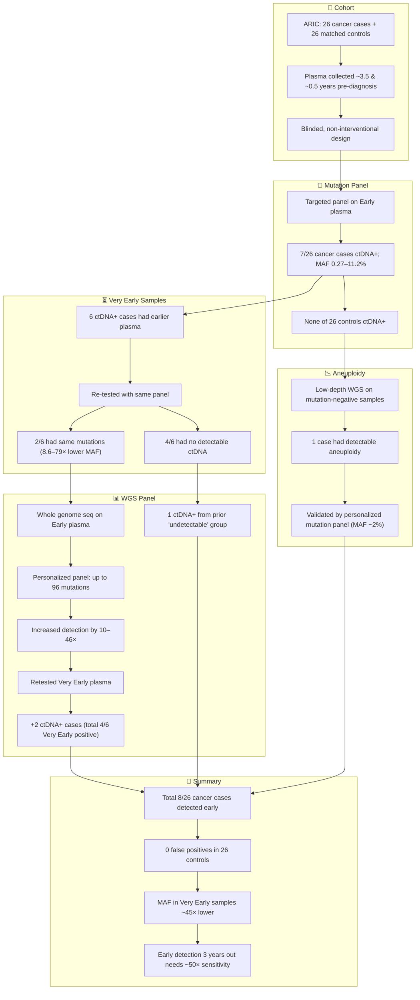

# Reference:
[https://pubmed.ncbi.nlm.nih.gov/40402478/](https://pubmed.ncbi.nlm.nih.gov/40402478/)

# **Summary**
Wang et al. conducted a proof-of-principle study to evaluate whether circulating tumor DNA (ctDNA) could be detected in blood samples collected years before clinical cancer diagnosis. Using serial plasma samples from the ARIC cohort, they analyzed 26 cancer cases and 26 matched controls. A multicancer early detection (MCED) test revealed ctDNA in some participants as early as 3.5 years before diagnosis, albeit at significantly lower allele frequencies than samples taken nearer diagnosis. The study established a sensitivity benchmark for detecting early cancers, demonstrating that ctDNA detection is feasible well before clinical onset, and suggesting that much higher sensitivity is required for very early detection.

# **Key Points**
1. Serial plasma samples from a prospective cohort enabled non-interventional early detection analysis.
2. A targeted driver gene panel detected ctDNA in 8 of 26 cancer cases, none in controls.
3. Mutations were traceable up to 3.5 years before diagnosis, at 8.6–79-fold lower allele frequencies.
4. Personalized mutation panels increased detection sensitivity using whole genome sequencing (WGS).
5. The study sets a benchmark: detecting cancer 3 years early requires ~50× greater sensitivity than 6 months prior.
6. Detection success depended on tumor DNA shedding and mutational burden.

# Logic Flow

