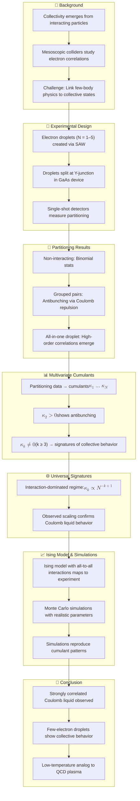

# Reference:
[https://pubmed.ncbi.nlm.nih.gov/40562919/](https://pubmed.ncbi.nlm.nih.gov/40562919/)

# Summary
This study demonstrates the emergence of collective behavior in few-electron systems, identifying a strongly correlated Coulomb liquid phase using mesoscopic collider techniques. Electron droplets, each containing 1–5 electrons, were transported by surface acoustic waves (SAWs) through a Y-junction. The partitioning of electrons into two detectors was statistically analyzed using multivariate cumulants, revealing high-order correlations beyond pairwise interactions. The observed patterns matched theoretical predictions for a Coulomb liquid, validated through Ising model mapping and Monte Carlo simulations. This work bridges few-body physics and thermodynamic behavior, offering a low-temperature, microscopic analog to quark-gluon plasma studies.

# Key Points
1. **SAW-driven droplets** with up to five electrons were guided through a tunable Y-junction.
2. **Multivariate cumulants** captured high-order correlations in partitioning statistics.
3. **Coulomb interactions** drive the formation of a strongly correlated liquid state.
4. **Universal scaling** of cumulants confirms emergence of collective behavior.
5. **Effective Ising model** and **Monte Carlo simulations** accurately reproduce observations.
6. Establishes a **mesoscopic analog to quark-gluon plasma** in condensed matter.

# Logic Flow

