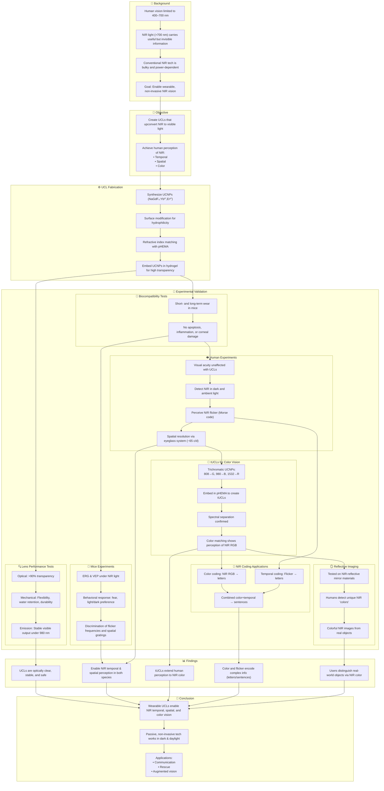

# Reference:
[https://pubmed.ncbi.nlm.nih.gov/40409271/](https://pubmed.ncbi.nlm.nih.gov/40409271/)

# Summary
This study introduces wearable upconversion contact lenses (UCLs) that grant humans the ability to perceive near-infrared (NIR) light across temporal, spatial, and color dimensions. These lenses integrate specially engineered upconversion nanoparticles (UCNPs) into transparent, flexible hydrogels, enabling non-invasive NIR vision. In both mice and humans, UCLs enable the discrimination of NIR light patterns and signals, including Morse code and coarse images. Furthermore, with trichromatic UCLs (tUCLs), users can perceive multiple NIR wavelengths as visible primary colors, thus achieving NIR color vision. A supplementary eyeglass system enables fine image resolution. These findings establish the feasibility of extending human sensory perception into the infrared spectrum using nano-engineered materials.

# Key Points
1. Developed transparent, flexible, biocompatible UCLs using refractive index-matched hydrogels and UCNPs.
2. Mice and humans wearing UCLs can detect NIR light and decode spatiotemporal patterns.
3. Trichromatic UCLs allow for NIR color perception using red, green, and blue visible-light emissions.
4. An eyeglass system enhances spatial resolution for fine NIR image recognition.
5. UCLs work through closed eyelids and in ambient light, expanding functional utility.
6. Technology enables NIR "color" detection in reflected images, with potential in communication, rescue, and augmented reality.
# Logic Flow

