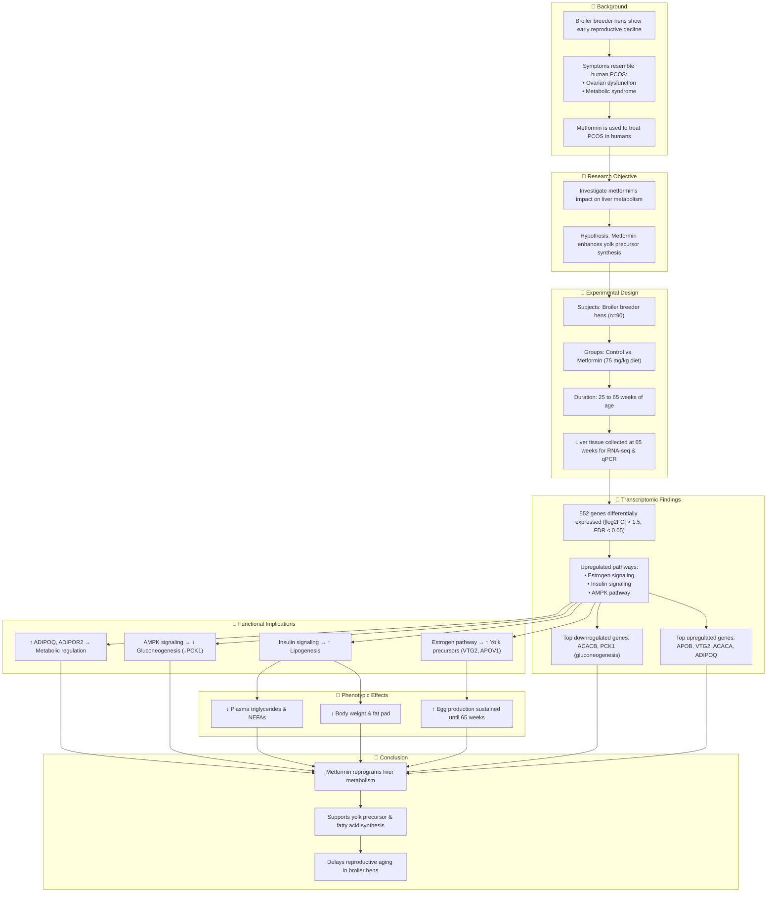

# Reference:
[https://pubmed.ncbi.nlm.nih.gov/40156092/](https://pubmed.ncbi.nlm.nih.gov/40156092/)

# Summary
Weaver et al. (2025) explore how **metformin**—a well-known antidiabetic drug—impacts liver metabolism to enhance reproductive longevity in **aging broiler breeder hens**, which typically face declining egg production with age. Through transcriptomic, metabolic, and reproductive analyses, the study finds that metformin shifts hepatic energy metabolism from lipogenesis toward oxidative phosphorylation and fatty acid oxidation. This metabolic reprogramming preserves follicle number and ovulatory function, effectively **sustaining egg production** into older age. The findings suggest that metformin’s role in aging extends beyond glycemic control and may be repurposed to enhance reproductive lifespan in other species.

# Key Points:
1. Aging broiler breeders suffer premature reproductive decline due to hepatic metabolic dysregulation.
2. Metformin treatment promotes mitochondrial oxidative metabolism over lipid synthesis in liver.
3. Improves metabolic flexibility and reduces hepatic fat accumulation.
4. Preserves ovarian follicle reserve and maintains egg-laying performance in older hens.
5. Transcriptomic data show upregulation of TCA cycle and fatty acid oxidation genes.
6. Suggests new applications for metformin in age-related reproductive decline.

# Logic Flow

