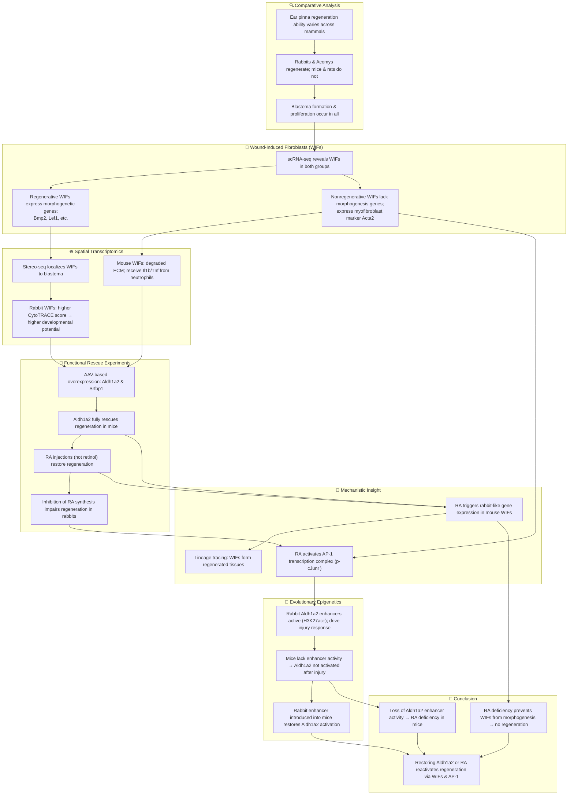

# Reference:
[https://pubmed.ncbi.nlm.nih.gov/40570123/](https://pubmed.ncbi.nlm.nih.gov/40570123/)

# Summary

This study investigates why mammals like mice and rats fail to regenerate ear pinnae after injury, unlike regenerative species such as rabbits and spiny mice. Using comparative single-cell and spatial transcriptomic analyses, the authors identify the insufficient production of retinoic acid (RA) — due to the lack of Aldh1a2 activation and boosted degradation pathways — as a key limiting factor. They find that wound-induced fibroblasts (WIFs), pivotal for regeneration, are transcriptionally impaired in nonregenerative species. The reactivation of Aldh1a2 expression or supplementation with RA reinitiates a regeneration program in nonregenerative mice, resembling that in rabbits. This regeneration is mediated through WIFs and is associated with activation of AP-1 transcriptional networks. The study uncovers an evolutionarily silenced genetic enhancer switch that can be reactivated to restore regenerative capacity in mammals.

---

# Key Points

1. **Aldh1a2** is critical for producing RA and is silenced in nonregenerative species after injury.
2. WIFs are present in both regenerative and nonregenerative species, but only regenerative WIFs activate morphogenetic genes.
3. Comparative transcriptomics reveals altered microenvironments and ligand interactions in mice.
4. Overexpression of **Aldh1a2** or RA supplementation restores regeneration in mice and rats.
5. RA activation enhances AP-1 transcription factor activity, crucial for regeneration.
6. Loss of Aldh1a2 expression is linked to inactivation of its regulatory enhancers in mice.

# Logic Flow

