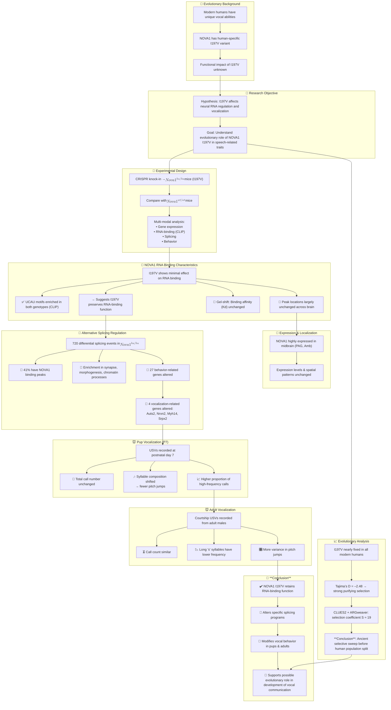

# Reference:
[https://pubmed.ncbi.nlm.nih.gov/39966351/](https://pubmed.ncbi.nlm.nih.gov/39966351/)
# Summary
This study investigates the physiological effects of a human-specific amino acid substitution (I197V) in the NOVA1 protein, which is essential for neural development and function. The researchers generated humanized mice carrying the I197V variant and compared them to wild-type mice to analyze the molecular and behavioral consequences. While the substitution had minimal impact on NOVA1's RNA binding capacity, it led to specific effects on alternative splicing and vocalization patterns in the humanized mice. The findings suggest that this human-specific NOVA1 variant may have been part of an ancient evolutionary selective sweep in a common ancestral population of Homo sapiens, potentially contributing to the development of spoken language through differential RNA regulation during brain development.

# Key Points:
1. NOVA1 is a neuronal RNA-binding protein essential for survival and development in mice and humans
2. A single amino acid change (I197V) in NOVA1 is unique to modern humans
3. Humanized mice carrying the I197V variant showed specific effects on alternative splicing and vocalization patterns compared to wild-type mice
4. The I197V substitution likely underwent a strong evolutionary selective sweep in the common ancestral population of modern humans
5. The findings suggest a potential role for the human-specific NOVA1 variant in the evolution of human language and communication

# Logic Flow

