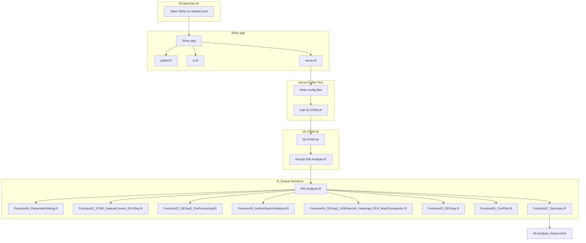
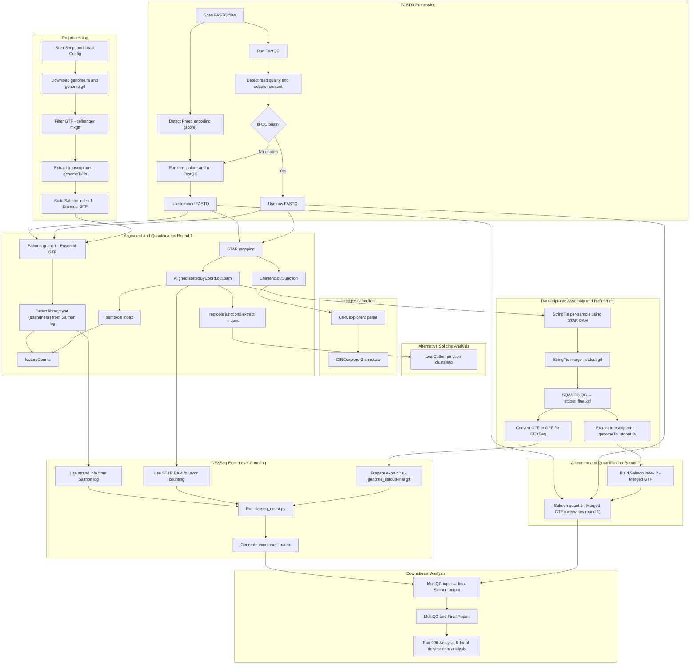
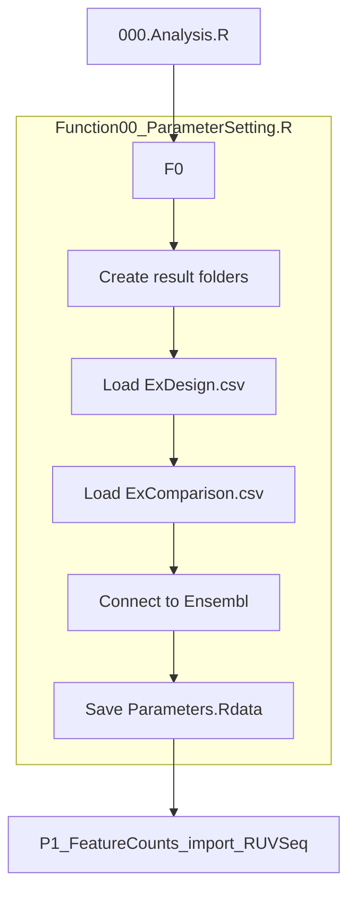
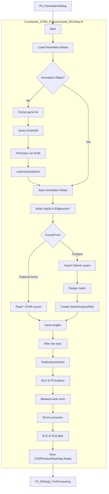
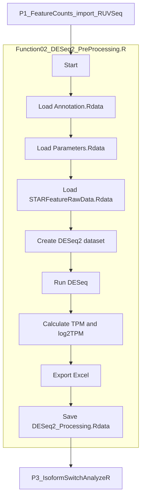
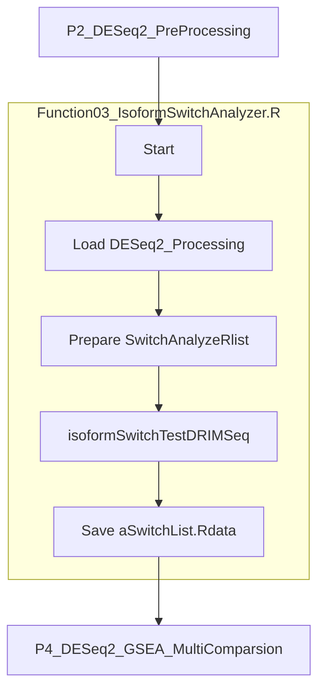
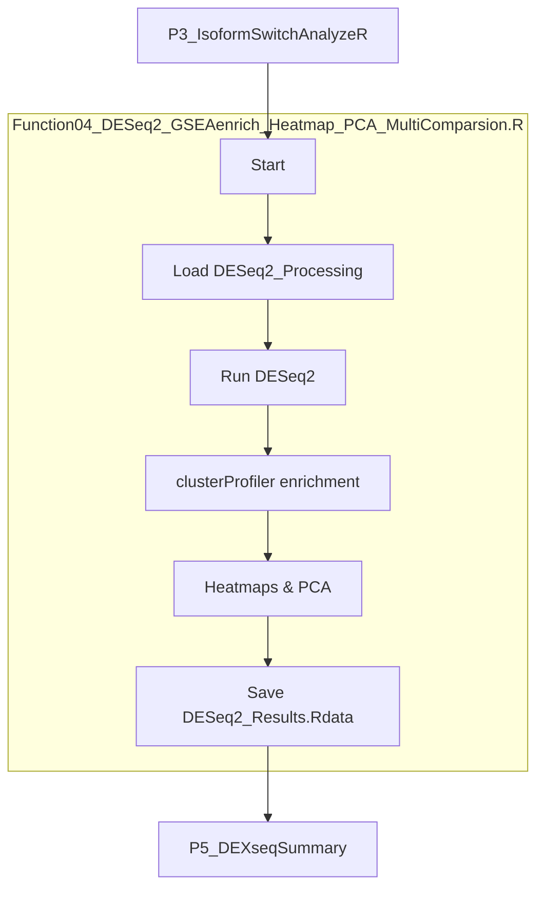
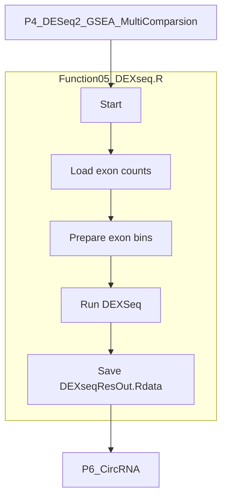
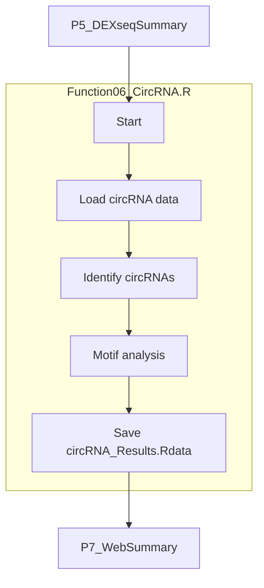
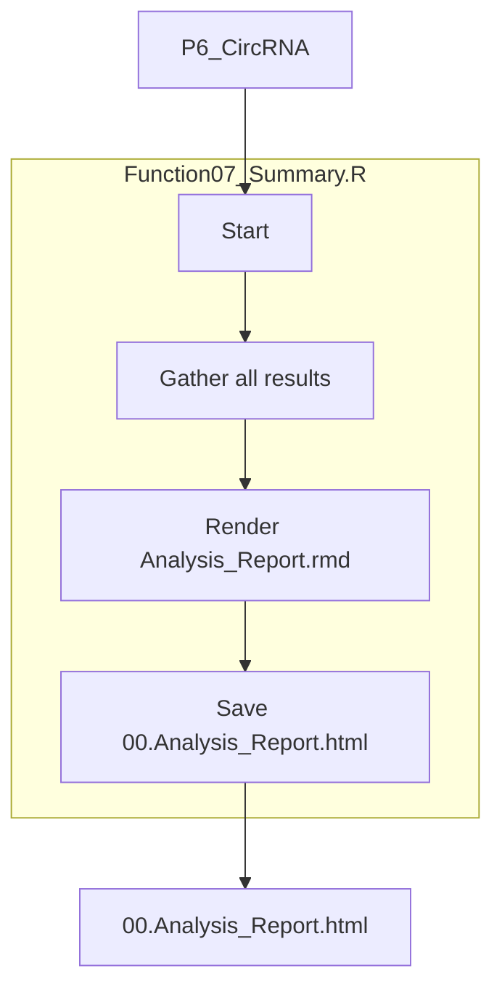

This entry documents a fully automated **B**ulk **R**NA-seq **A**uto **P**ipeline (**BRAP**) that performs read alignment, transcript quantification, splicing analysis, transcriptome assembly, and statistical analysis. The pipeline dynamically adapts to input data quality and structure, ensuring robust and reproducible results.

---

## 1. Overview

The diagram below summarizes how the main scripts interact. Clicking **Run** in the Shiny interface writes configuration files and spawns the shell workflow which finishes by generating the final report.



## 2. Short reads mapping

The main bash script performs read mapping and quantification. A detailed workflow for this step is provided below (unchanged from the previous version).
### 2.1. Workflow Overview

This pipeline performs:

- ✅ FASTQ quality control and trimming
- ✅ STAR-based genome alignment
- ✅ Salmon transcript quantification (2 rounds)
- ✅ Transcriptome assembly via StringTie
- ✅ Transcriptome refinement via SQANTI3
- ✅ circRNA detection (CIRCexplorer2)
- ✅ Alternative splicing (LeafCutter)
- ✅ Exon-level quantification (DEXSeq)
- ✅ Final analysis and visualization in R
#### 2.1.1 Workflow Diagram


---

### 2.2. Step-by-Step Description

#### 2.2.1 Environment Setup

- Activates `SQANTI3.env` Conda environment
- Parses settings from `ExConfiguration_bashScript.txt`

#### 2.2.2 Genome Preparation

- Downloads genome FASTA and GTF from Ensembl
- Optionally adds exogenous sequences (e.g., GFP)
- Filters GTF using `cellranger mkgtf`
- Builds:
  - STAR index
  - Salmon transcriptome index (with decoy)
  - Pfam HMM database

#### 2.2.3 FASTQ Processing

- Detects FASTQ files and normalizes extensions
- Runs **FastQC** on raw reads
- Detects:
  - **Phred encoding** from first 5k reads
  - **Read quality** and **adapter contamination**
- Triggers `trim_galore` if needed
- Reruns FastQC on trimmed reads

#### 2.2.4 Alignment & Quantification (Round 1)

- Aligns reads using **STAR**
- Outputs:
  - `*.bam` (sorted and indexed)
  - `*.Chimeric.out.junction` (for circRNA)
  - `*.junc` (from `regtools` for LeafCutter)
- Quantifies transcripts using **Salmon** (based on Ensembl GTF)
- Detects **library strandness** from `salmon_quant.log`
- Applies strandness to `featureCounts`

#### 2.2.5 Splicing and circRNA

- **LeafCutter** analyzes alternative splicing from `.junc` files
- **CIRCexplorer2** annotates circRNAs using STAR chimeric junctions

#### 2.2.6 Transcriptome Assembly & Refinement

- **StringTie** assembles transcripts per sample using STAR BAMs
- Merges GTFs into a master transcriptome
- **SQANTI3** filters and corrects transcript models
- Generates:
  - `stdout_final.gtf`
  - `genomeTx_stdout.fa`
  - `genome_stdoutFinal.gff` for DEXSeq

#### 2.2.7 Quantification (Round 2)

- Deletes first Salmon output
- Builds new Salmon index using `stdout_final.gtf`
- Re-runs **Salmon quantification (round 2)** — overwrites round 1
- These outputs are used for MultiQC and downstream analysis

#### 2.2.8 DEXSeq Exon Counting

- Uses:
  - Refined GFF (`genome_stdoutFinal.gff`)
  - STAR BAMs
  - Strandness from Salmon
- Runs `dexseq_count.py` to generate `*.exon.txt` files

#### 2.2.9 MultiQC Report

- Runs `multiqc .` to collect:
  - FastQC, Salmon, STAR, featureCounts, trim_galore, etc.
  - Includes only **final** Salmon outputs

#### 2.2.10 Final R Analysis

- Executes: `Rscript 000.Analysis.R`
- Performs:
  - Normalization
  - PCA, RLE, clustering
  - DEG or splicing analysis
  - HTML and table outputs

---

### 2.3. Dynamic Features

| Property            | Detected From              | Applied In                  |
|---------------------|----------------------------|-----------------------------|
| Phred encoding      | First 5k reads (ASCII)     | `trim_galore`               |
| Read quality        | FastQC                     | Triggers trimming           |
| Adapter presence    | FastQC                     | Triggers trimming           |
| Library strandness  | `salmon_quant.log`         | `featureCounts`, DEXSeq     |

---

### 2.4. Output Summary

| Output                        | Description                                |
|-------------------------------|--------------------------------------------|
| `*.bam`, `*.bai`              | STAR-aligned and indexed BAM files         |
| `Salmon_quants/`             | Final transcript quantification (TPM, etc) |
| `*.counts`                   | Gene-level quantification from featureCounts |
| `*.exon.txt`                 | DEXSeq exon bin counts                     |
| `LeafCutter.Output/`         | Splicing analysis results                  |
| `*_CIRCexplorer2.ce`         | circRNA annotations                        |
| `stdout_final.gtf`           | Refined transcriptome annotation           |
| `multiqc_report.html`        | Aggregated QC and alignment metrics        |
| `00.Analysis_Report.html`    | Custom final R analysis report             |

---

### 2.5. Getting Started

1. Prepare the input directory with:
   - `ExConfiguration_bashScript.txt`
   - Raw or trimmed FASTQ files
2. Run:

   ```bash
   bash 00.STAR.sh <path_to_your_project>
   ```

3. Inspect outputs:
   - BAMs, counts, and QC
   - HTML reports
   - Final analysis results from `000.Analysis.R`

---

### 2.6. Dependencies

- `STAR`, `Salmon`, `StringTie`, `samtools`, `featureCounts`
- `trim_galore`, `FastQC`, `regtools`, `CIRCexplorer2`
- `SQANTI3`, `LeafCutter`, `DEXSeq`, `MultiQC`
- `R` with custom script: `000.Analysis.R`

---

### 2.7. Notes

- The pipeline is **idempotent**: already-completed steps are skipped unless missing.
- Highly suitable for both **canonical and custom transcriptome exploration**.
- Ideal for both bulk RNA-seq and pseudo-bulk analyses.

---

## 3.  Comprehensive analysis in R

The R script `000.Analysis.R` orchestrates downstream processing once the bash pipeline is finished. It sequentially calls helper functions located under `R_Source/`.

### 3.1 P0_ParameterSetting
The workflow initializes parameters for all downstream steps.

### 3.2 P1_FeatureCounts_import_RUVSeq
This step imports counts, builds annotations and applies RUVSeq correction.

### 3.3 P2_DESeq2_PreProcessing
This function normalizes counts and prepares DESeq2 objects.

### 3.4 P3_IsoformSwitchAnalyzeR
This step detects isoform switches.

### 3.5 P4_DESeq2_GSEA_MultiComparsion
This function performs differential expression and enrichment analyses.

### 3.6 P5_DEXseqSummary
This function computes exon usage with DEXSeq.

### 3.7 P6_CircRNA
This function summarizes circRNA evidence.

### 3.8 P7_WebSummary
This step generates the HTML report.


## 4. Structure of Analysis_Report.html
The HTML report generated by `P7_WebSummary` contains:
- **0 Description of Workflow**
- **1 Sample Sequencing Statistics** with reference info, QC, Salmon statistics and RUVSeq correction
- **2 Analysis** covering differential expression, enrichment, isoform switches and circular RNA
- **3 Support** and **4 Citation** sections
- **5 Supplementary** with source code and running log

---

# 5. Example results from this workflow

1. https://d3dcaz4rv8jgb4.cloudfront.net/ from [Zheng Y, Wang Z, Weng Y, Sitosari H, He Y, Zhang X, Shiotsu N, Fukuhara Y, Ikegame M, Okamura H. **Gingipain regulates isoform switches of PD-L1 in macrophages infected with Porphyromonas gingivalis**. _Scientific reports_. **2025** Mar 26;15(1):10462.](https://www.nature.com/articles/s41598-025-94954-7)
2. https://dndy5us1uro9a.cloudfront.net/BulkRNAseq/00.Analysis_Report.html from [Weng Y, Wang Z, Sitosari H, Ono M, Okamura H, Oohashi T. **_O_‐GlcNAcylation regulates osteoblast differentiation through the morphological changes in mitochondria, cytoskeleton, and endoplasmic reticulum**. _BioFactors_. **2025** Jan;51(1):e2131.](https://iubmb.onlinelibrary.wiley.com/doi/abs/10.1002/biof.2131)