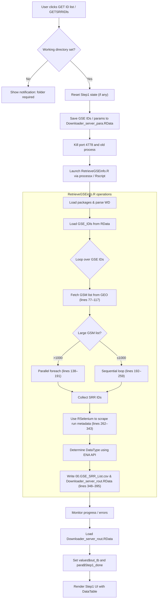

# Workflow overview
## Step 1: GET SRR ID list 

---

# Running Demo in Video

A running demo is shown in a YouTube Video below:

---

If you found this helpful, feel free to comment, share, and follow for more. Your support encourages us to keep creating quality content.