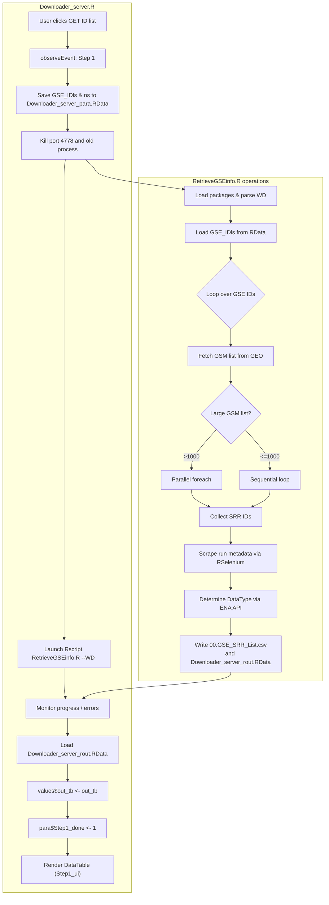
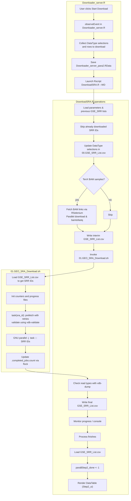
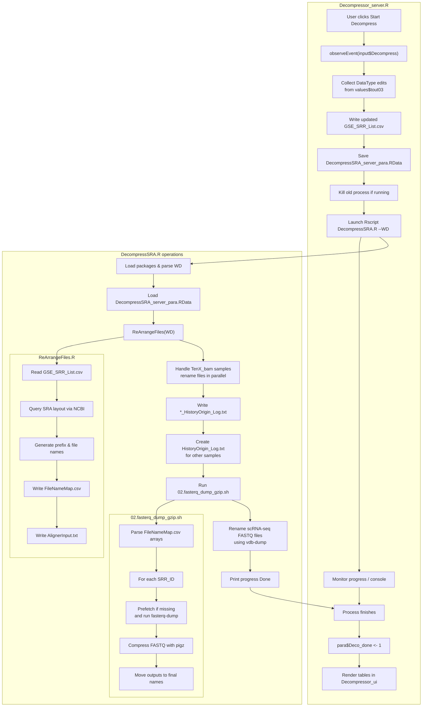

GREP1 provides a Shiny interface for retrieving and preparing GEO/SRA sequencing data. The application guides the user through three sequential tasks:

1. **Retrieve SRR information** from user-supplied GSE accession numbers.
2. **Download** `.sra` or TenX BAM files.
3. **Decompress** the archives to FASTQ files for downstream analysis.

## Folder overview
- `global.R` – shared setup loaded by both UI and server components.
- `ui.R` – builds the Shiny layout with modules for each step.
- `server.R` – coordinates the modules and maintains application state.
- `01.ShinyModules/` – server and UI code for the downloader and decompressor.
- `03.R_Source/` – standalone R scripts (`RetrieveGSEinfo.R`, `DownloadSRA.R`,
  `DecompressSRA.R`, `ReArrangeFiles.R`).
- `04.bash_Source/` – shell helpers called by the R scripts.
- `00.launcher.sh` – convenience script to set up the environment and start the
  Shiny server.

## Step 1: Get SRR ID list
The first step fetches GSM and SRR information from GEO for each input GSE accession. A child R process executes `RetrieveGSEinfo.R`, which collects run metadata using RSelenium and the ENA API.

## Step 2: Download .sra or TenX BAM files
`DownloadSRA.R` reads the SRR list, fetches TenX BAM files if requested, and runs a shell script to prefetch SRA archives in parallel.

## Step 3: Decompress SRA files
After downloading, `DecompressSRA.R` rearranges the archives and invokes `02.fasterq_dump_gzip.sh` to produce compressed FASTQ files. TenX BAM samples are renamed and tracked in history logs.

## Launching the app
Run `00.launcher.sh` from this directory to set up the Conda environment and start the Shiny server. The application opens in your default web browser.

## Demo video
A short demonstration of the GREP1 workflow can be seen on YouTube:

---

If you found this helpful, feel free to comment, share, and follow for more. Your support encourages us to keep creating quality content.