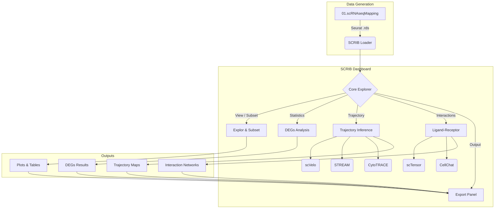
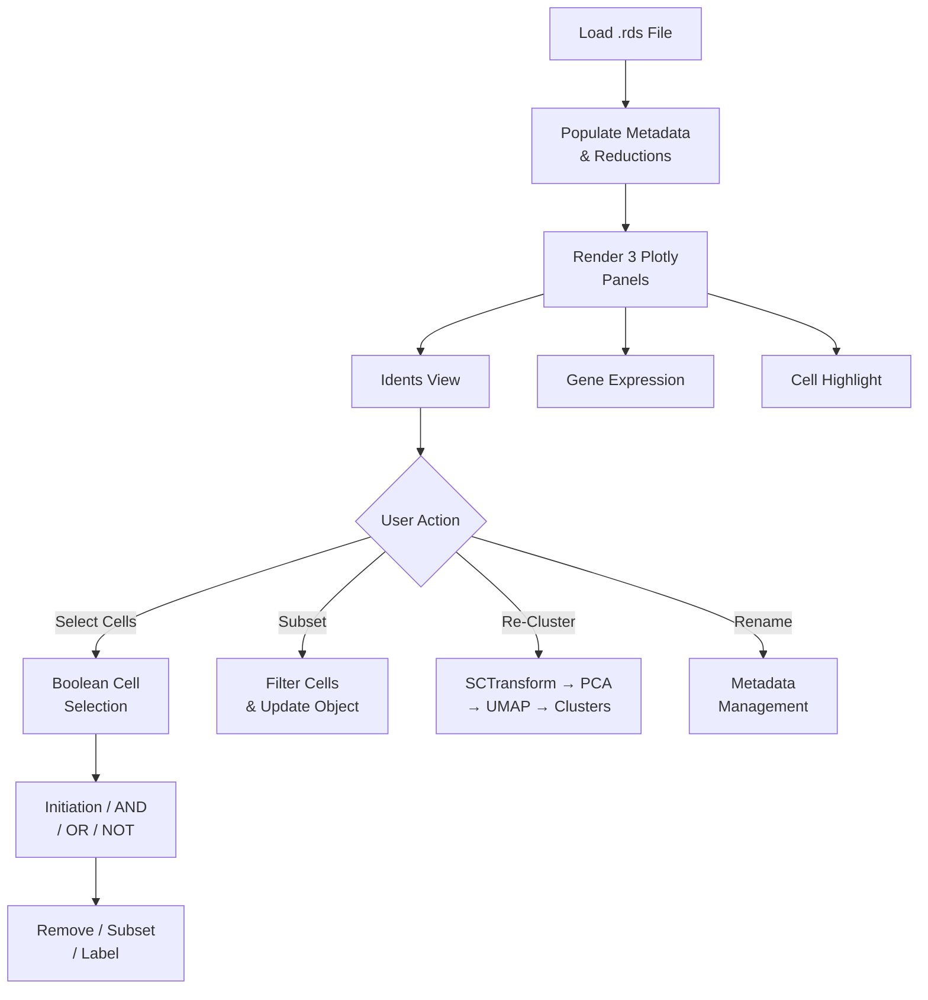
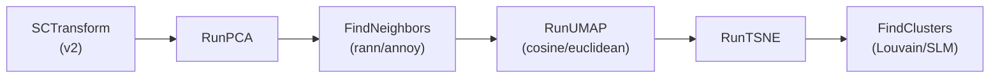
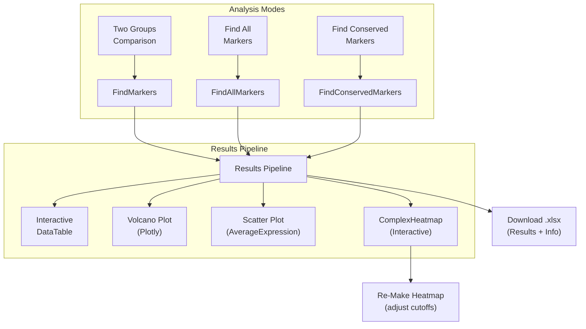
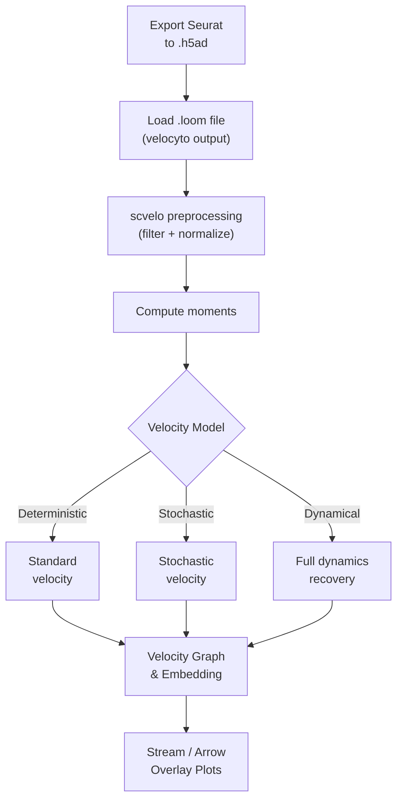
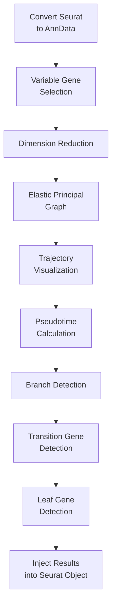
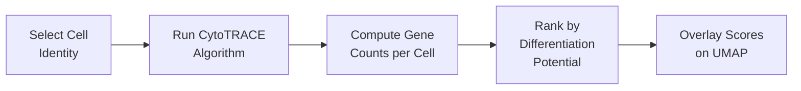
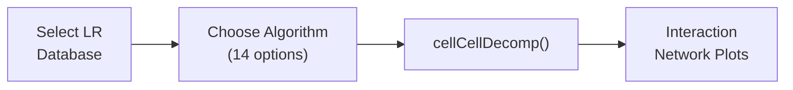
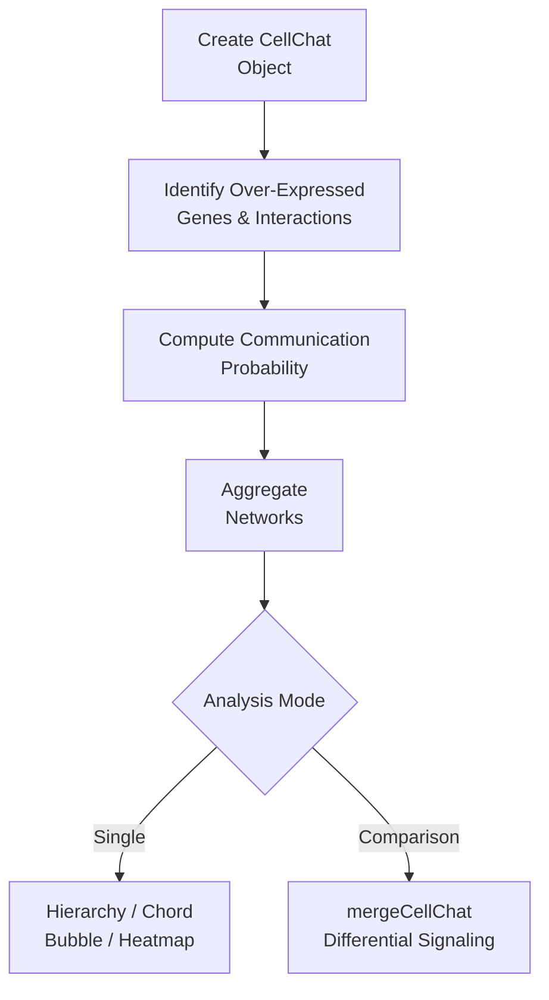
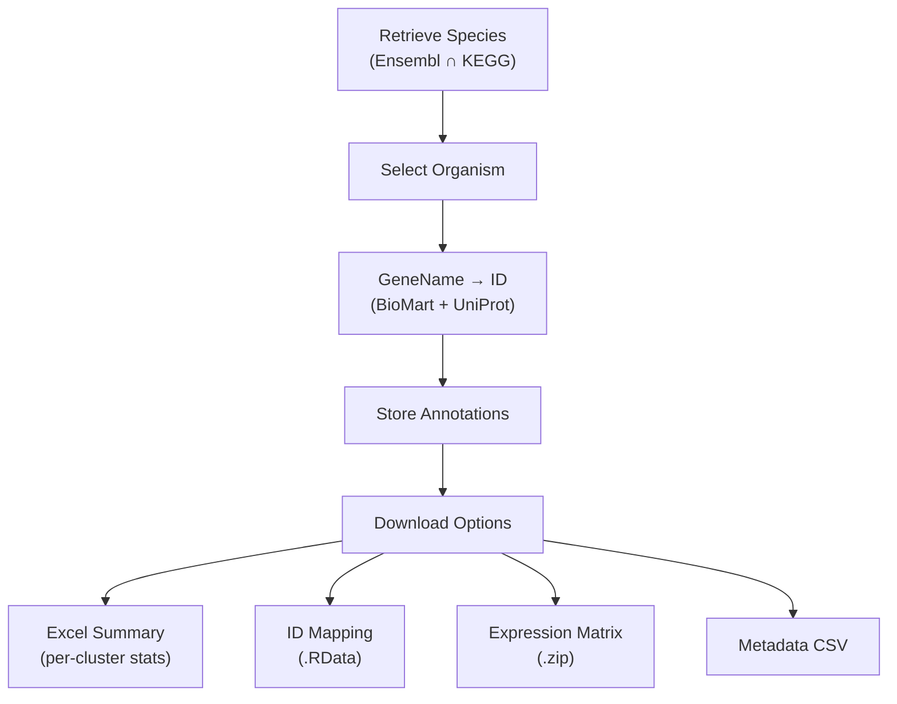

**SCRIB** (Single-Cell RNA-seq Interactive Browser) derives its name from a real human gene symbol (*SCRIB*, encoding the scribble planar cell polarity protein). It naturally matches our application's purpose, as a "browser" acts as an interactive explorer for single-cell transcriptomic data. SCRIB is an interactive Shiny-based dashboard that allows users to seamlessly navigate through scRNA-seq datasets, perform clustering, identify differentially expressed genes (DEGs), trace cellular trajectories (RNA velocity, CytoTRACE, STREAM), and analyze cell-cell communications (CellChat, scTensor). SCRIB is designed to natively ingest `.rds` objects processed by the upstream [[01.scRNAseqMapping]] module.

## §1 System Architecture



## §2 Folder Structure

SCRIB follows the standard GW4RA modular architecture to manage its extensive feature set (over 35,000 lines of UI code and 5,400 lines of server logic):

* `global.R` — Initializes 59 R packages and shared conda environments.
* `server.R` — Main backend orchestrator.
* `ui.R` — Main dashboard layout (sidebar and navigation).
* `00.launcher.sh` — Bash script to launch the app securely (handles stack limits and port binding).
* `01.ShinyModules/` — Sub-directories for specific analysis interfaces (e.g., `scVelo_server.R`, `CellChat_ui.R`).
* `03.R_Source/` — Custom R helpers (`MakePlotlyPlot.R`, `IDConvertFuns.R`).
* `00.pySource/` — Python wrappers for tools lacking native R implementations (e.g., `velocyto`).

## §3 Core Explorer & Subsetting

The Core Explorer handles data ingestion, subsetting, and foundational visualization (UMAP/t-SNE/PCA). Users can selectively isolate specific clusters or conditions to dynamically update downstream analytical pipelines.



### Cell Selection Logic

SCRIB provides a multi-criteria cell selection system with Boolean logic:

| Operation | Description |
|-----------|-------------|
| **Initiation** | Start a new selection from current filter |
| **AND** | Intersect accumulator with current filter |
| **OR** | Union accumulator with current filter |
| **NOT** | Subtract current filter from accumulator |
| **Remove** | Delete highlighted cells from dataset |
| **Subset** | Keep only highlighted cells |
| **Label** | Assign custom metadata name to selected cells |

### Re-Clustering Pipeline



## §4 DEGs Analysis

The Differential Expression Genes module supports three distinct analysis strategies using Seurat's marker detection framework, with 8 statistical methods.



**Supported statistical methods**: `wilcox`, `bimod`, `t`, `negbinom`, `poisson`, `LR`, `MAST`, `DESeq2`

**Group definition**: Supports 1-factor or 2-factor comparisons. Conserved markers analysis identifies consistent markers across a grouping variable (e.g., condition) using `metap::minimump`.

## §5 RNA Velocity (scVelo)

Integrates with the Python `scvelo` package to infer cellular dynamics from spliced and unspliced mRNA counts. Requires `.loom` files mapped against the genome.



> [!NOTE]
> All scVelo operations are executed via `reticulate::py_run_string()` within the `WZY_scRNAseq` Conda environment.

## §6 STREAM Trajectory

Single-cell Trajectories Reconstruction, Exploration And Mapping (STREAM) provides advanced pseudo-time analysis and branch assignment, specifically useful for complex developmental paths.



Results are injected back into the Seurat object as new reductions and metadata columns, making them immediately available in the Core Explorer.

## §7 CytoTRACE

Predicts the differentiation state (developmental potential) of cells based on the number of expressed genes without requiring prior temporal information.



## §8 Ligand-Receptor Analysis

### scTensor

Utilizes tensor decomposition of cell-cell interaction matrices. Supports 14 decomposition algorithms with species-specific LR databases.



### CellChat

Quantitative inference and analysis of intercellular communication networks, supporting both single-dataset and comparative analyses.



## §9 Export Panel

The Export module provides comprehensive data output capabilities with integrated gene annotation.



## §10 Input Requirements

SCRIB requires a pre-processed Seurat object (saved as an `.rds` file). The upstream **[[01.scRNAseqMapping]]** module ensures these objects contain the necessary structural components:
- Processed `assays` (RNA, SCT)
- Computed `reductions` (pca, umap, tsne)
- Standardized metadata columns (e.g., `Meta_Ls0`, `Meta_Ls1`, `Meta_Ls2`) for UI compatibility.

## §11 Launching the App

SCRIB should be launched via its wrapper script to ensure memory limits and conda environments are correctly instantiated:

```bash
cd /path/to/RNAseqToolkit/SCRIB
bash 00.launcher.sh
```

> [!WARNING]
> Stack Size Limit
> Running SCRIB with >30K cells requires an increased stack size. The `00.launcher.sh` handles this automatically, but if running manually in RStudio, you must execute `ulimit -s 16438` before starting the session.

## §12 Dependencies

SCRIB relies on a comprehensive suite of tools spanning both R and Python ecosystems. Key packages include:

* **Core Analysis**: `Seurat` (4.2.0), `monocle3`
* **Visualization**: `ComplexHeatmap` (2.10.0), `ggplot2`, `plotly`
* **Trajectory**: `velocyto` (0.17), `scvelo` (0.2.4)
* **Interactions**: `CellChat`, `scTensor`
* **Imputation**: `MAGIC` (v3.0.0)
* **Framework**: `shiny`, `shinydashboard`, `shinythemes`

*(For the complete list of 59 packages, refer to `global.R`)*

## §13 Video Tutorials

For a visual guide on navigating and utilizing the SCRIB dashboard, please refer to the following tutorial videos:

**SCRIB Overview & Basic Features**  
This tutorial provides a comprehensive introduction to SCRIB, covering data loading, clustering, and basic visualizations.
<iframe width="560" height="315" src="https://www.youtube.com/embed/kRlbA6tx9I4" title="YouTube video player" frameborder="0" allow="accelerometer; autoplay; clipboard-write; encrypted-media; gyroscope; picture-in-picture; web-share" allowfullscreen></iframe>

**Advanced Analysis & Trajectory Inference**  
Dive deeper into SCRIB's advanced capabilities, including RNA velocity, STREAM trajectories, and cell-cell communication.
<iframe width="560" height="315" src="https://www.youtube.com/embed/L43fL5eOhUE?start=322" title="YouTube video player" frameborder="0" allow="accelerometer; autoplay; clipboard-write; encrypted-media; gyroscope; picture-in-picture; web-share" allowfullscreen></iframe>
