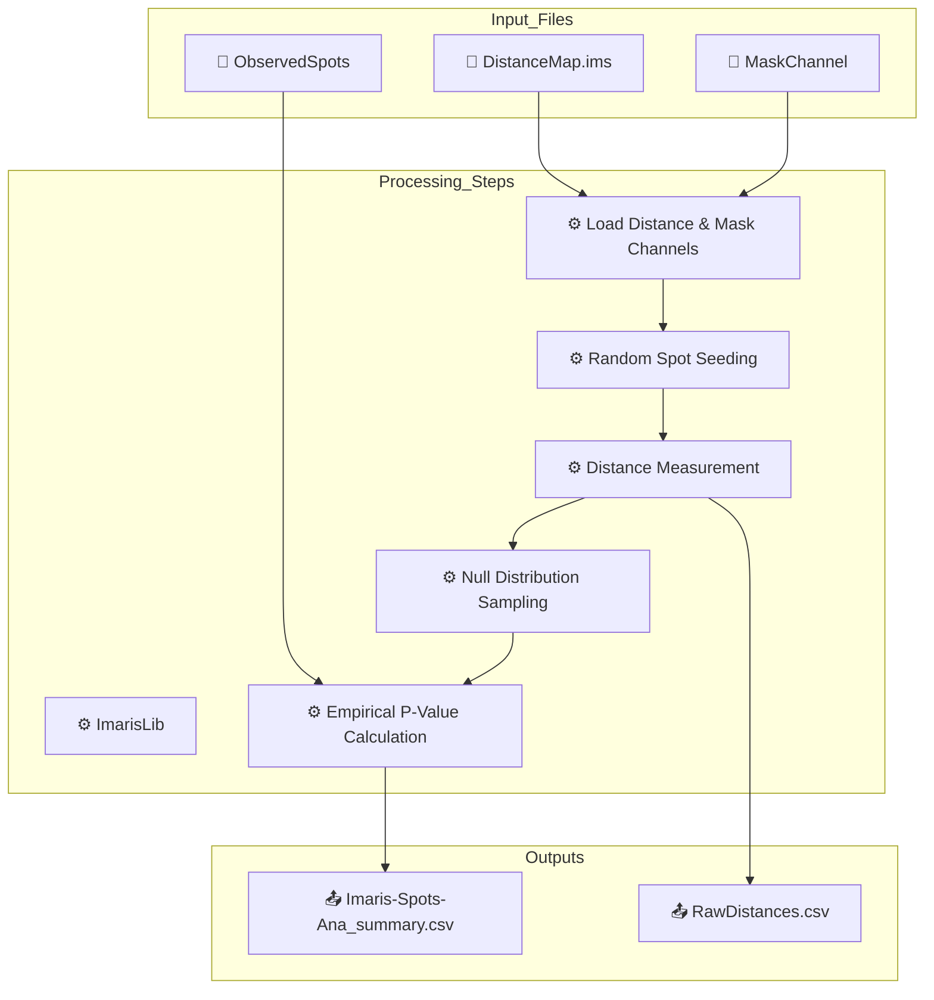

## 🧾 TL;DR — Imaris 3D Random Spots Distance Analysis
This Imaris XT Python workflow performs a 3D null model analysis by randomly generating spots within a masked volume and calculating their shortest distances to a reference structure, based on a precomputed distance-transform channel. It runs Monte Carlo simulations at multiple seed counts (500–4000 and observed N), compares the distribution of random distances to those of observed spots, and outputs statistical summaries including empirical p-values.

### 📄 Required Files
| 📁 File           | 🧾 Description                                     |
| ----------------- | -------------------------------------------------- |
| `DistanceMap.ims` | 3D image containing a distance-transform channel   |
| `MaskChannel`     | Binary mask channel defining valid sampling region |
| ObservedSpots     | Real experimental spot set to compare against      |

### 🛠 Required Scripts
| ⚙️ Script                                                                                                                                                   | 🔧 Purpose                                      |
| ----------------------------------------------------------------------------------------------------------------------------------------------------------- | ----------------------------------------------- |
| `ImarisLib.py`                                                                                                                                              | Interface to Imaris XT and image access         |
| [`Imaris_Analysis-RandomSpots.ipynb`](https://raw.githubusercontent.com/LabOnoM/DK.BeesGO/master/source/content/01.Files/Imaris_Analysis-RandomSpots.ipynb) | Main script for seeding, sampling, and analysis |

### 🧭 Workflow Summary
1. Connects to an open Imaris application using ImarisLib.
2. Make a distance map of your target signal by using the "Distance Transformation" from Image Processing -> Surfaces Functions -> Distance Transformation (requires XTension); name this channel as "distance."
3. Use the mask function to your structure surface object for masking the possible region as 1 and blocked region as 0; name this channel as "mask."
4. Identifies the appropriate distance and mask channels using name hints or indices.
5. Randomly seeds 3D spots within the mask at different `N` values using Monte Carlo simulation.
6. Measures shortest distances from each random spot to the structure (from the distance channel).
7. Repeats the simulation `N_ITER` times to build null distributions of mean distances.
8. Compares observed mean distance to null distribution and computes empirical p-values.

### 📂 Output Files
| 📤 Output                      | 📌 Content                                             |
| ------------------------------ | ------------------------------------------------------ |
| `Imaris-Spots-Ana_summary.csv` | Mean distances and p-values for each N condition       |
| `*.csv` (optional)             | Raw distances for each spot per iteration (if enabled) |

