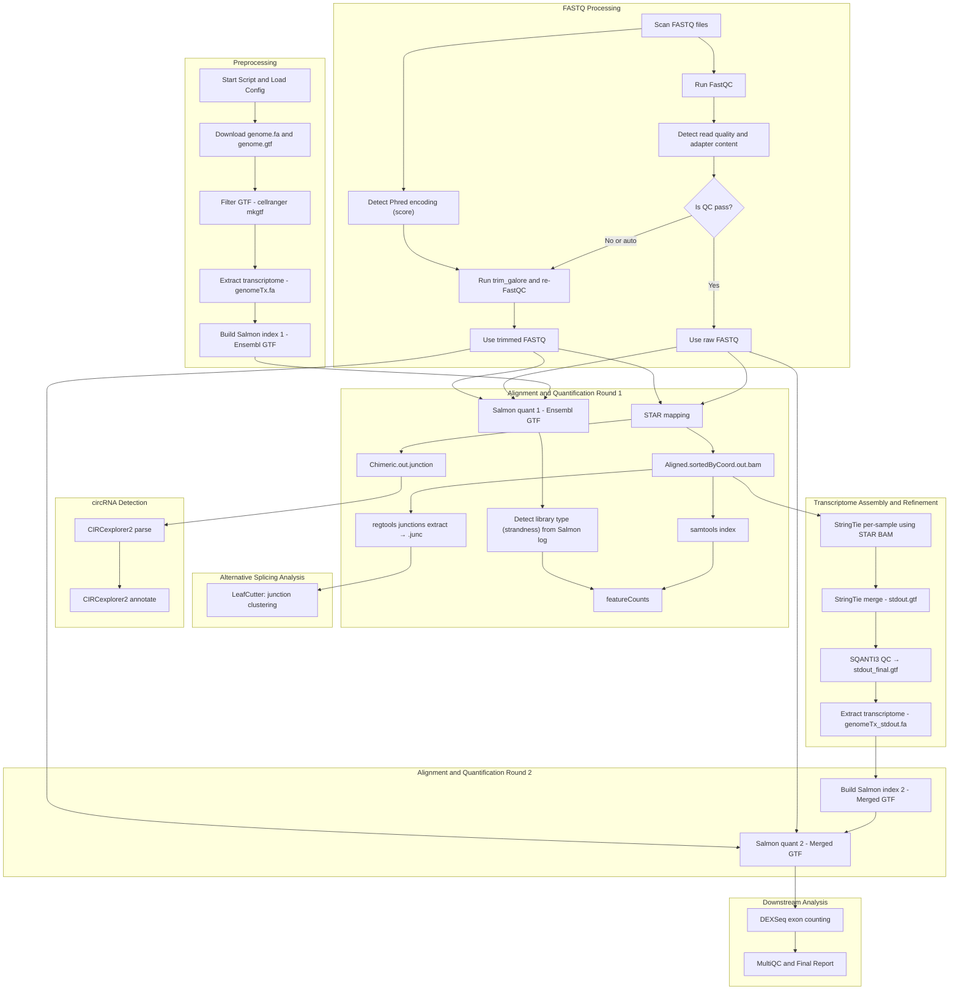

# 🗺️ Workflow Diagram

```mermaid
graph TD

  

subgraph Preprocessing

A1[Start Script and Load Config] --> A2[Download genome.fa and genome.gtf]

A2 --> A3[Filter GTF - cellranger mkgtf]

A3 --> A4[Extract transcriptome - genomeTx.fa]

A4 --> A5[Build Salmon index 1 - Ensembl GTF]

end

  

subgraph FASTQ Processing

B1[Scan FASTQ files] --> B2[Run FastQC]

B2 --> B3["Detect read quality and adapter content"]

B3 --> B4{Is QC pass?}

B4 -- Yes --> B5[Use raw FASTQ]

B4 -- No or auto --> B6[Run trim_galore and re-FastQC]

B1 --> B7["Detect Phred encoding (score)"]

B7 --> B6

B6 --> B8["Use trimmed FASTQ"]

end

  

subgraph Alignment and Quantification Round 1

B5 --> C1[STAR mapping]

B8 --> C1

C1 --> C2[Aligned.sortedByCoord.out.bam]

C1 --> C3[Chimeric.out.junction]

C2 --> C4[samtools index]

C2 --> C5[regtools junctions extract → .junc]

C4 --> C6[featureCounts]

A5 --> D1[Salmon quant 1 - Ensembl GTF]

B5 --> D1

B8 --> D1

D1 --> D2["Detect library type (strandness) from Salmon log"]

D2 --> C6

end

  

subgraph Alternative Splicing Analysis

C5 --> L1[LeafCutter: junction clustering]

end

  

subgraph circRNA Detection

C3 --> M1[CIRCexplorer2 parse]

M1 --> M2[CIRCexplorer2 annotate]

end

  

subgraph Transcriptome Assembly and Refinement

C2 --> E1[StringTie per-sample using STAR BAM]

E1 --> E2[StringTie merge - stdout.gtf]

E2 --> E3[SQANTI3 QC → stdout_final.gtf]

E3 --> E4[Extract transcriptome - genomeTx_stdout.fa]

end

  

subgraph Alignment and Quantification Round 2

E4 --> F1[Build Salmon index 2 - Merged GTF]

F1 --> F2[Salmon quant 2 - Merged GTF]

B5 --> F2

B8 --> F2

end

  

subgraph Downstream Analysis

F2 --> Z1[DEXSeq exon counting]

Z1 --> Z2[MultiQC and Final Report]

end
```
