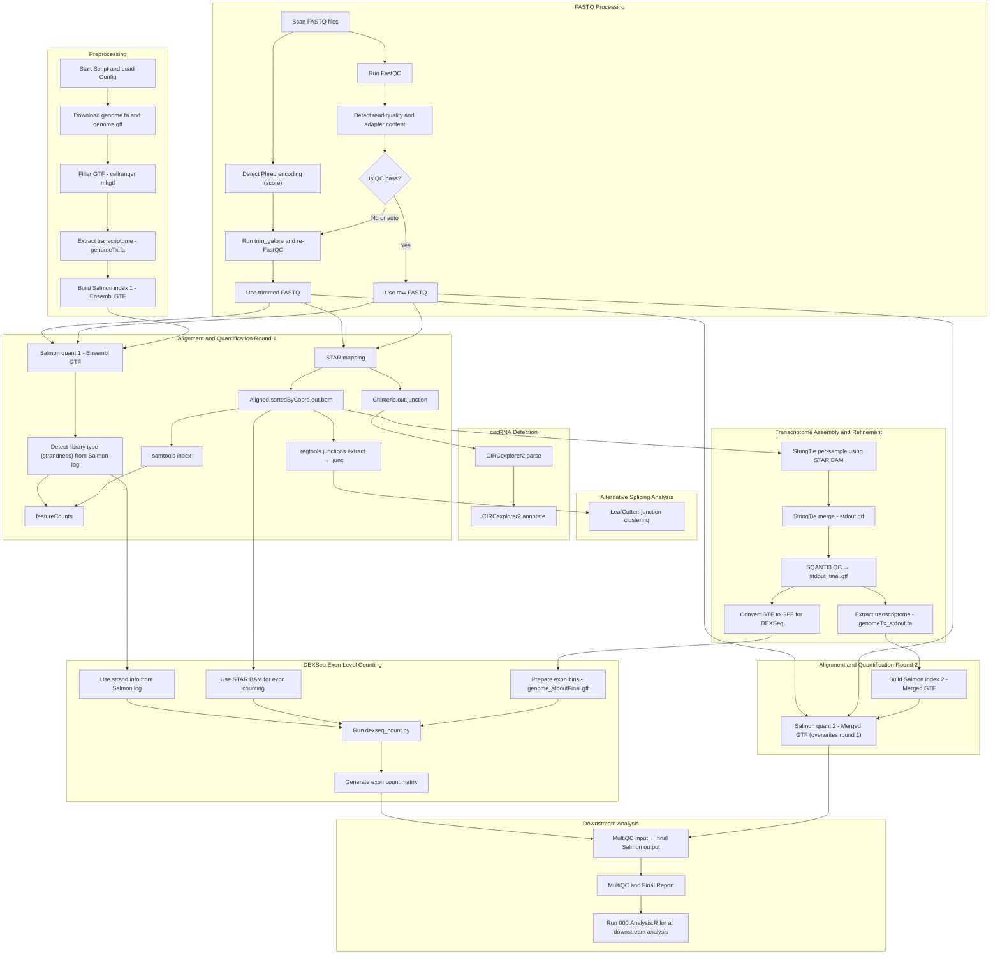

This entry documents a fully automated RNA-seq processing pipeline that performs read alignment, transcript quantification, splicing analysis, transcriptome assembly, and statistical analysis. The pipeline dynamically adapts to input data quality and structure, ensuring robust and reproducible results.

---
# Short reads mapping
## 📋 Workflow Overview

This pipeline performs:

- ✅ FASTQ quality control and trimming
- ✅ STAR-based genome alignment
- ✅ Salmon transcript quantification (2 rounds)
- ✅ Transcriptome assembly via StringTie
- ✅ Transcriptome refinement via SQANTI3
- ✅ circRNA detection (CIRCexplorer2)
- ✅ Alternative splicing (LeafCutter)
- ✅ Exon-level quantification (DEXSeq)
- ✅ Final analysis and visualization in R
## 🗺️ Workflow Diagram


---

## 🔁 Step-by-Step Description

### 1. Environment Setup

- Activates `SQANTI3.env` Conda environment
- Parses settings from `ExConfiguration_bashScript.txt`

### 2. Genome Preparation

- Downloads genome FASTA and GTF from Ensembl
- Optionally adds exogenous sequences (e.g., GFP)
- Filters GTF using `cellranger mkgtf`
- Builds:
  - STAR index
  - Salmon transcriptome index (with decoy)
  - Pfam HMM database

### 3. FASTQ Processing

- Detects FASTQ files and normalizes extensions
- Runs **FastQC** on raw reads
- Detects:
  - **Phred encoding** from first 5k reads
  - **Read quality** and **adapter contamination**
- Triggers `trim_galore` if needed
- Reruns FastQC on trimmed reads

### 4. Alignment & Quantification (Round 1)

- Aligns reads using **STAR**
- Outputs:
  - `*.bam` (sorted and indexed)
  - `*.Chimeric.out.junction` (for circRNA)
  - `*.junc` (from `regtools` for LeafCutter)
- Quantifies transcripts using **Salmon** (based on Ensembl GTF)
- Detects **library strandness** from `salmon_quant.log`
- Applies strandness to `featureCounts`

### 5. Splicing and circRNA

- **LeafCutter** analyzes alternative splicing from `.junc` files
- **CIRCexplorer2** annotates circRNAs using STAR chimeric junctions

### 6. Transcriptome Assembly & Refinement

- **StringTie** assembles transcripts per sample using STAR BAMs
- Merges GTFs into a master transcriptome
- **SQANTI3** filters and corrects transcript models
- Generates:
  - `stdout_final.gtf`
  - `genomeTx_stdout.fa`
  - `genome_stdoutFinal.gff` for DEXSeq

### 7. Quantification (Round 2)

- Deletes first Salmon output
- Builds new Salmon index using `stdout_final.gtf`
- Re-runs **Salmon quantification (round 2)** — overwrites round 1
- These outputs are used for MultiQC and downstream analysis

### 8. DEXSeq Exon Counting

- Uses:
  - Refined GFF (`genome_stdoutFinal.gff`)
  - STAR BAMs
  - Strandness from Salmon
- Runs `dexseq_count.py` to generate `*.exon.txt` files

### 9. MultiQC Report

- Runs `multiqc .` to collect:
  - FastQC, Salmon, STAR, featureCounts, trim_galore, etc.
  - Includes only **final** Salmon outputs

### 10. Final R Analysis

- Executes: `Rscript 000.Analysis.R`
- Performs:
  - Normalization
  - PCA, RLE, clustering
  - DEG or splicing analysis
  - HTML and table outputs

---

## 🔍 Dynamic Features

| Property            | Detected From              | Applied In                  |
|---------------------|----------------------------|-----------------------------|
| Phred encoding      | First 5k reads (ASCII)     | `trim_galore`               |
| Read quality        | FastQC                     | Triggers trimming           |
| Adapter presence    | FastQC                     | Triggers trimming           |
| Library strandness  | `salmon_quant.log`         | `featureCounts`, DEXSeq     |

---

## 📦 Output Summary

| Output                        | Description                                |
|-------------------------------|--------------------------------------------|
| `*.bam`, `*.bai`              | STAR-aligned and indexed BAM files         |
| `Salmon_quants/`             | Final transcript quantification (TPM, etc) |
| `*.counts`                   | Gene-level quantification from featureCounts |
| `*.exon.txt`                 | DEXSeq exon bin counts                     |
| `LeafCutter.Output/`         | Splicing analysis results                  |
| `*_CIRCexplorer2.ce`         | circRNA annotations                        |
| `stdout_final.gtf`           | Refined transcriptome annotation           |
| `multiqc_report.html`        | Aggregated QC and alignment metrics        |
| `00.Analysis_Report.html`    | Custom final R analysis report             |

---

## 🚀 Getting Started

1. Prepare the input directory with:
   - `ExConfiguration_bashScript.txt`
   - Raw or trimmed FASTQ files
2. Run:

   ```bash
   bash 00.STAR.sh <path_to_your_project>
   ```

3. Inspect outputs:
   - BAMs, counts, and QC
   - HTML reports
   - Final analysis results from `000.Analysis.R`

---

## 📚 Dependencies

- `STAR`, `Salmon`, `StringTie`, `samtools`, `featureCounts`
- `trim_galore`, `FastQC`, `regtools`, `CIRCexplorer2`
- `SQANTI3`, `LeafCutter`, `DEXSeq`, `MultiQC`
- `R` with custom script: `000.Analysis.R`

---

## 🧠 Notes

- The pipeline is **idempotent**: already-completed steps are skipped unless missing.
- Highly suitable for both **canonical and custom transcriptome exploration**.
- Ideal for both bulk RNA-seq and pseudo-bulk analyses.

---
# Comprehensive analysis in R
